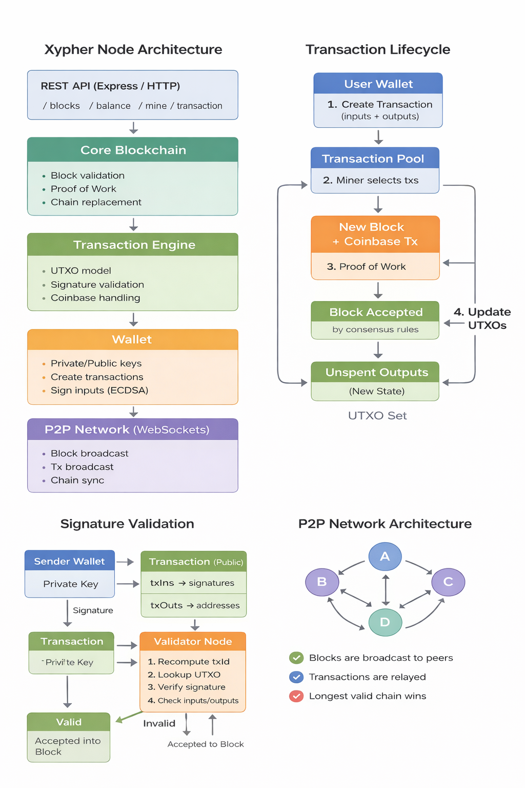

<hr>
Xypher is a fast, secure, and decentralized cryptocurrency built from scratch using TypeScript and Node.js. The project demonstrates core blockchain architecture, peer-to-peer networking, cryptographic security, and a real-time Angular dashboard for interacting with the network.

This system simulates a complete Web3 environment where nodes maintain consensus, transactions are validated, and users manage wallets with full ownership of their digital assets.

## Features 
- Custom blockchain implementation in TypeScript.  
- Proof-of-Work mining with adjustable difficulty.  
- Peer-to-peer network synchronization using WebSockets.  
- Transaction validation and mempool management.  
- ECDSA wallet generation and digital signatures.  
- REST API for node interaction.  
- Angular dashboard for blockchain visualization.  
- Real-time network updates.  
- Modular and scalable architecture.

## Dashboard


## System Architecture
```
flowchart LR

    subgraph Client Layer
        A[Angular App<br>xypher-ui]
    end

    subgraph API Layer
        B[Express HTTP Server]
        C[P2P Server]
    end

    subgraph Core Blockchain Engine
        D[Blockchain Logic]
        E[Transaction System]
        F[Wallet System]
        G[Mining Engine]
    end

    subgraph Data Layer
        H[(MongoDB Database)]
    end

    subgraph Network Layer
        I[Peer Nodes]
    end

    A -->|REST API| B
    B --> D
    B --> E
    B --> F
    B --> G

    D --> H
    E --> H

    C --> I
    D --> C
```

### Architecture Layers
<hr>

**Blockchain Layer**
- Block creation and validation  
- Hashing and chain integrity  
- Proof-of-Work mining  

**Network Layer**
- Peer discovery and communication  
- Blockchain synchronization  
- Broadcast of new blocks  

**Wallet Layer**
- Public/private key generation  
- Transaction signing  
- Balance tracking  

**API Layer**
- External access to blockchain data  
- Node control and monitoring  

**Frontend Layer**
- Blockchain explorer  
- Wallet interface  
- Transaction submission  
- Peer network dashboard

## File Structure 
```
XYPHER-CRYPTOCURRENCY/
├── src/
│ ├── blockchain.ts         # Block & chain logic
│ ├── p2p.ts                # Peer-to-peer networking
│ ├── transaction.ts        # Transactions & validation
│ ├── transactionPool.ts    # Mempool handling
│ ├── wallet.ts             # Wallet & key management
│ ├── util.ts               # Hashing & helpers
│ └── main.ts               # App entry point
|── xypther-ui/              Angular Frontend
│   └── src/
│       └── app/
│           ├── core/
│           │   ├── services/
│           │   │   ├── blockchain.service.ts
│           │   │   ├── wallet.service.ts
│           │   │   └── websocket.service.ts
│           │   ├── models/
│           │   │   ├── block.model.ts
│           │   │   ├── transaction.model.ts
│           │   │   └── wallet.model.ts
│           │   └── interceptors/
│           │       └── http-error.interceptor.ts
│           │
│           ├── features/
│           │   ├── dashboard/
│           │   │   └── dashboard.component.ts
│           │   ├── wallet/
│           │   │   ├── wallet-balance/
│           │   │   └── send-transaction/
│           │   ├── explorer/
│           │   │   ├── block-list/
│           │   │   ├── block-detail/
│           │   │   └── transaction-detail/
│           │   └── network/
│           │       └── peer-list/
│           │
│           └── shared/
│               ├── components/
│               └── pipes/
├── dist/                   # Compiled JavaScript output
├── img/                    # Screenshots & diagrams
├── package.json
├── tsconfig.json
├── tslint.json
└── README.md
```
## Angular Dashboard
```
cd xypther-ui
npm install
ng serve
```
## Tech Stack 
- TypeScript – type-safe backend development
- Node.js – runtime
- CryptoJS – SHA-256 hashing
- elliptic – ECDSA public-key cryptography
- WebSocket (ws) – peer-to-peer networking
- Express – REST API

## ▶️ Getting Started
### 1. Install Dependencies
``` bash
npm install
```
### 2. Build the Project 
``` bash
npm run build
```
### 3. start a Node 
``` bash
npm start
```
### 4.(Optional) Start Multiple Nodes
``` bash
HTTP_PORT=3002 P2P_PORT=6002 npm start
```
## API Endpoints
```
GET                     /blocks Retrieve                            fullblockchain
```
```
POST	                /mineBlock	                                Mine new block
```
```
POST	                /sendTransaction	                    Create transaction
```
```
GET	                    /peers	                              List connected peers
```
```
POST	                /addPeer	                           Connect to new peer
```
<hr>


## Blockchain 

The structure only include the most essential properties.
- index : The height of the block in the blockchain
- data: Any data that is included in the block.
- timestamp: A timestamp
- hash: A sha256 hash taken from the content of the block
- previousHash: A reference to the hash of the previous block. This value explicitly defines the previous block.


### Block Hash

One of the most critical parts of a cryptocurrency is **hashing**. In this project the hash is calculated over all data of the block. which means if anything in the block changes the original hash is no longer valid.

The block hash can also be though of as a unique identifier. For Example if the blocks with the same index can happen, but they all have unique hashes.


## Node Communication
An essential responsibility of each node is to share and synchronize the blockchain with other nodes in the network. To maintain consistency across the network, the following rules are applied:
- When a node creates a new block, it broadcasts the block to all connected peers.
- When a node connects to a new peer, it requests the peer’s latest block.
- If a node receives a block with an index higher than its current latest block, it either appends the block to its chain or requests the full blockchain to resolve any discrepancies.


### Proof of Work Puzzle
So far in the project we have made a simiple toy block chain that could add a block without cost. `Proof-of-work`can add some complexities before the block is added to the blockchain. In which solving this puzzle is known as **mining**.
#### Difficulty/Nonce
To understand why we need difficulty and nonce we will look at what the `Proof-of-work` puzzle is doing.

To simplify the `Proof-of-work` puzzle is to find a block hash hat has a specific number of zeros prefixing it. 

The **difficulty** property defines the number of zeros prefixing the block hash needs. In order for the block to be validated the zeros are checked from binary of the hash. 


To produce a hash that meets the difficulty requirement, we need a way to generate many different hashes from the same block data. This is achieved by changing the nonce value. Since SHA-256 is a cryptographic hash function, even a small change to the block’s contents results in a completely different hash. Mining is essentially the process of repeatedly adjusting the nonce and recalculating the hash until one is found that satisfies the difficulty target.

## Architecture
